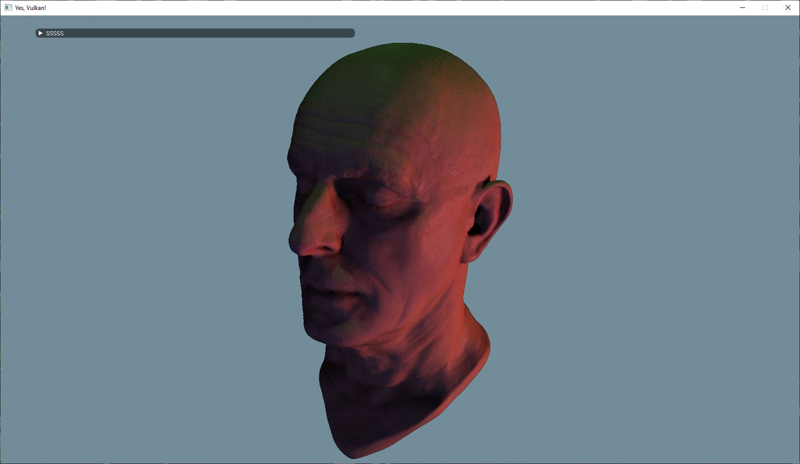
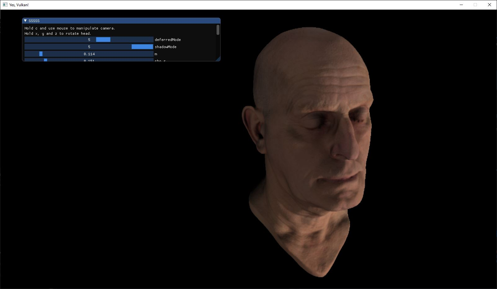
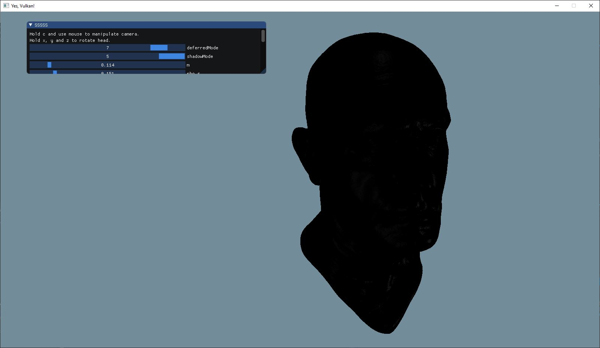
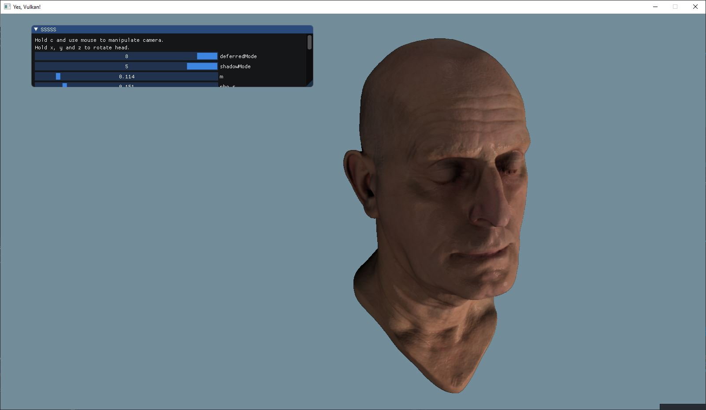
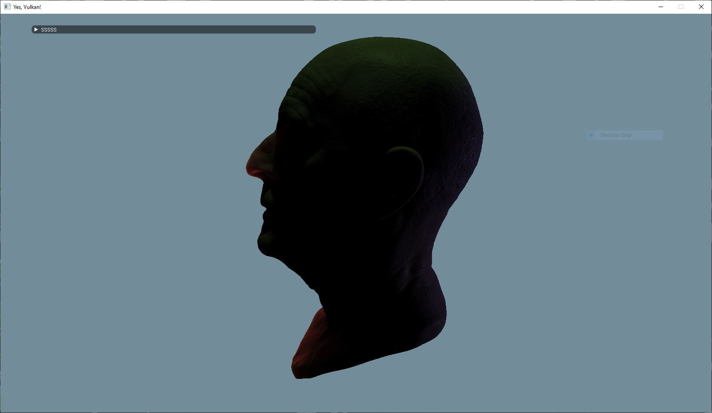
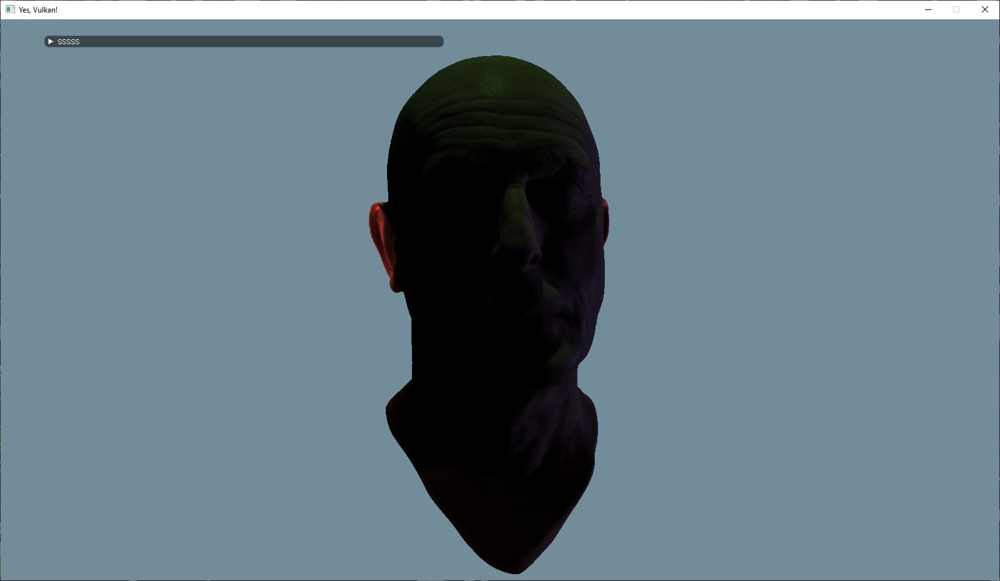

# vksssss
A screen space sub-surface scattering demo implemented with vulkan api

## Overview

## Scattering

* Albedo

* Blur once

* Blur twice

* Blur three times

* Blur four times

* Blur five times

* Blur six times

* Specular

* Final Composite

## Translucency

## References

* https://www.derschmale.com/2014/06/02/deferred-subsurface-scattering-using-compute-shaders/
* http://www.iryoku.com/sssss/
* https://colinbarrebrisebois.com/2011/03/07/gdc-2011-approximating-translucency-for-a-fast-cheap-and-convincing-subsurface-scattering-look/